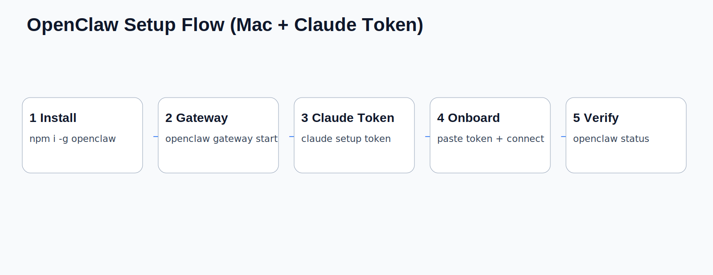
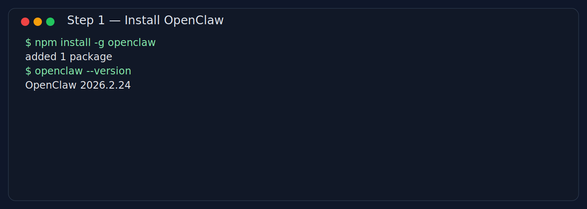
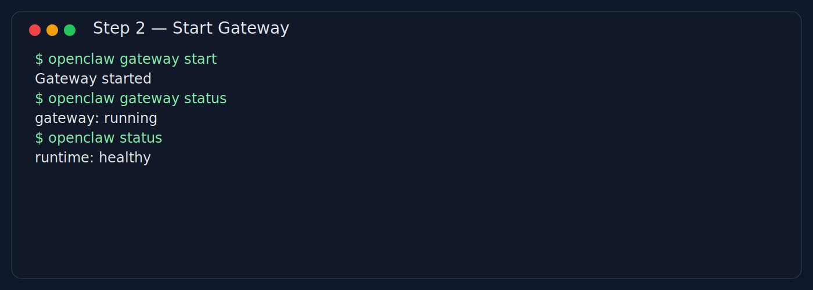
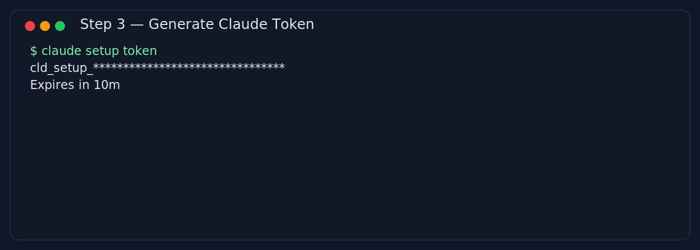
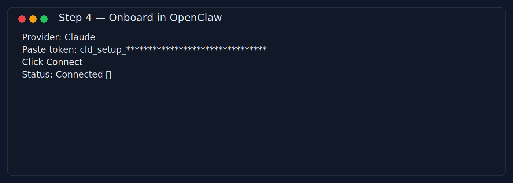
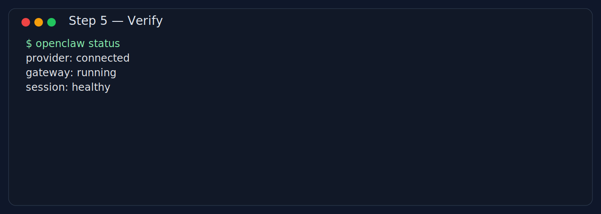

# OpenClaw Team Setup Guide (Mac First, Action-Only)

Audience: New to OpenClaw, CLI-comfortable engineers  
Style: Minimal explanation, maximum execution  
Security: Never share raw tokens/secrets

---

## Visual Flow (Share This First)



---

## 1) Local Mac Setup

### Goal
Install OpenClaw and confirm CLI works.

### Run
```bash
node -v
npm -v
npm install -g openclaw
openclaw --version
```

### Expect
- Node and npm return versions
- OpenClaw version prints

### If broken
```bash
npm config get prefix
npm doctor
which openclaw
```
Fix npm global PATH/prefix, then reinstall.



---

## 2) Start Gateway + Health Check

### Goal
Start OpenClaw services locally.

### Run
```bash
openclaw gateway start
openclaw gateway status
openclaw status
```

### Expect
- Gateway reports running
- `openclaw status` returns healthy runtime/session data

### If broken
```bash
openclaw gateway restart
openclaw gateway status
openclaw status
```
If still failing: check local process/port conflicts.



---

## 3) Generate Claude Setup Token (Mac)

### Goal
Get a fresh setup token from Claude Code CLI.

### Run
```bash
claude setup token
```

### Expect
- Token printed (short-lived)

### If broken
- Ensure Claude CLI is installed and authenticated.
- Complete Claude login/auth flow, then retry.

Security rule:
- Do not paste raw token into chats/docs.
- Use redacted screenshots only.



---

## 4) OpenClaw Onboarding (Paste Token)

### Goal
Connect Claude provider in OpenClaw onboarding.

### Run
1. Open OpenClaw onboarding flow.
2. Select Claude provider.
3. Paste token from step 3.
4. Click Connect.

### Expect
- Provider = connected
- New session can respond normally

### If broken
- Regenerate token and retry immediately
- Remove accidental spaces/newlines in token
- Restart gateway and re-open onboarding



---

## 5) Smoke Test (2 minutes)

### Goal
Verify setup is truly usable.

### Run
```bash
openclaw gateway status
openclaw status
```
Then send a simple prompt in OpenClaw:
- `Reply with current model and one-line health check.`

### Expect
- Gateway running
- Session responds
- Model is reported

### If broken
- Restart gateway
- Re-onboard token
- Retry in a fresh session



---

## 6) Optional Team Integrations (No Secrets)

Use only when needed.

### GitHub CLI
```bash
gh auth status
```
If not authenticated:
```bash
gh auth login
```

### Vercel CLI
```bash
vercel --version
vercel login
```

### Railway CLI
```bash
railway --version
railway login
```

### Memory system (workspace continuity)
- `memory/YYYY-MM-DD.md` = daily logs
- `MEMORY.md` = curated long-term context

### OAuth paths / fallbacks / model manager
- Keep provider tokens in local secure env only
- Always keep at least one fallback provider path documented
- Validate model in runtime with `openclaw status`

---

## 7) Optional VPS / Serverless Paths

Use when you need always-on service, team-shared endpoint, or region-specific deployment.

- Tencent Cloud (CN): https://cloud.tencent.com/act/pro/lighthouse-moltbot
- Alibaba Cloud (EN): https://www.alibabacloud.com/en/campaign/ai-openclaw?_p_lc=1&utm_content=se_1023047690&gclid=EAIaIQobChMIocfGnKbbkgMV3CyDAx3Pyx9uEAAYASAAEgLXDfD_BwE
- Serverless template: https://github.com/serithemage/serverless-openclaw

### VPS quick checklist
1. Provision instance / serverless env
2. Install Node + OpenClaw
3. Configure environment variables (no secrets in docs)
4. Start gateway/service
5. Confirm external access/DNS/callback path
6. Run smoke test

---

## 8) Troubleshooting Matrix (Fast Lookup)

| Symptom | Run | Fix |
|---|---|---|
| `openclaw: command not found` | `which openclaw` | Reinstall globally and fix npm PATH |
| Gateway won’t start | `openclaw gateway status` | `openclaw gateway restart`; resolve process/port conflicts |
| Token rejected | `claude setup token` | Regenerate token; paste clean value; retry quickly |
| Onboarding stuck | `openclaw status` | Restart gateway + reopen onboarding |
| CLI works but session fails | `openclaw status` | Re-check provider connection/auth |
| VPS endpoint unreachable | host/network checks | verify DNS, firewall, callback routes, env vars |

---

## 9) LLM-Executable Prompt Block (For Ops)

Copy this into your preferred LLM assistant when setting up a fresh machine:

```text
You are setting up OpenClaw on macOS. Execute in order and stop on failure.
1) Verify Node/npm versions.
2) Install OpenClaw globally.
3) Start gateway and confirm health.
4) Ask me to run `claude setup token` manually and paste result securely.
5) Guide onboarding: select Claude provider, paste token, connect.
6) Run final smoke test (`openclaw status`) and report pass/fail.
For every failure, print exact fix commands before proceeding.
Do not expose secrets in logs or outputs.
```

---

## 10) Deliverable Notes

- Screenshots in this guide are safe, redacted, and illustration-style.
- Replace with live UI captures if internal policy requires exact UI proof.
- Keep this as one single source-of-truth onboarding doc for new engineers.
